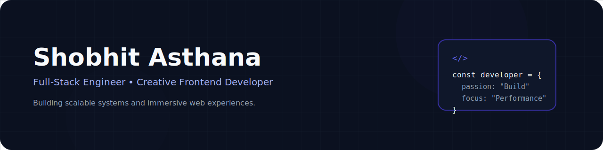

<!-- Hero Section -->

  

 

 

> Building scalable web applications and modern user experiences.

---

<!-- About section -->

##  About Me

I'm Shobhit Asthana, a Full-Stack Developer from India who enjoys building modern, scalable, and user-focused web applications.

I primarily work with JavaScript, React, Node.js, Express, and MongoDB while continuously learning technologies like Next.js, Three.js, Docker, Redis, AWS, and AI.

I enjoy transforming ideas into clean, responsive, and high-performance digital experiences with a strong focus on user experience and maintainable code.

---

<!-- Technical Ecosystem -->

Core technologies used to design, build, and ship production-grade full-stack products

  

<table width="100%" cellspacing="0" cellpadding="0" border="0">
<tr>

<td align="center" valign="top" width="25%">

  

 <b>React</b>

  

 <b>Next.js</b>

  

 <b>JavaScript</b>

  

 <b>TypeScript</b>

  

 <b>HTML5</b>

  

 <b>CSS3</b>

  

 <b>Tailwind CSS</b>

  

 <b>GSAP</b>

  

 <b>Three.js</b>

  

  

 <b>Framer Motion</b>

  

  

</td>

<td align="center" valign="top" width="25%">

  

 <b>Node.js</b>

  

 <b>Express.js</b>

  

  

 <b>JWT</b>

  

 <b>Socket.io</b>

  

 <b>Firebase</b>

  

 <b>Supabase</b>

  

 <b>Prisma</b>

</td>

<td align="center" valign="top" width="25%">

  

 <b>MongoDB</b>

  

 <b>MySQL</b>

  

 <b>PostgreSQL</b>

  

 <b>Redis</b>

</td>

<td align="center" valign="top" width="25%">

  

 <b>Git</b>

  

 <b>GitHub</b>

  

 <b>Docker</b>

  

 <b>Postman</b>

  

 <b>VS Code</b>

  

 <b>Vercel</b>

  

 <b>Figma</b>

  

 <b>Linux</b>

  

 <b>NPM</b>

</td>

</tr>
</table>

